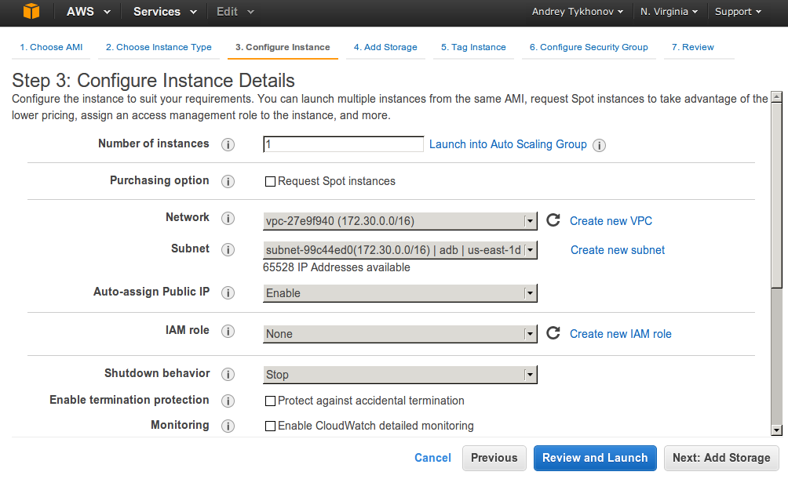

# Launch master instance


Click `Launch Instance`.

##  Step 1: Choose an Amazon Machine Image (AMI)


Select `Community AMIs`. Check `Red Hat` checkbox.


Then click `Select`.


## Step 2: Choose an Instance Type

Choose `t2.large` and click `Next: Configure Instance Details`.


##  Step 3: Configure Instance Details

If you don't have any network (VPC) please create it. Please create subnet as well, if there is no any subnet in the list.

Please change `Auto-assign Public IP` to `Enable`.



Click `Next: Add Storage`.

##  Step 4: Add Storage

Input into the field `Size (GiB)` value `25`. Click `Next: Tag Instance`.


## Step 5: Tag Instance

Just click `Next: Configure Security Group`.

##  Step 6: Configure Security Group

Select `All traffic` from select-box `Type` and click `Review and Launch`.


##  Step 7: Review Instance Launch

Click `Launch`!


## Select an existing key pair or create a new key pair

Select "Create a new key pair" and input key pair name (e.g. `cloudera`), then click `Download Key Pair` and save the file. After that the `Launch Instances` button will become enabled. Click it.


## Launch status

Here you can see launch status. Click on `View Instances`.


## Instances

Here we can see the list of launched instances.


Before connection to the instance, please change permissions for the recently downloaded `cloudera.pem` file:

```
chmod 600 cloudera.pem
```

On top of the list you can see the running instance. The one which has been recently created.

From the bottom panel take `Public IP` of the instance and put it to `/etc/hosts`:

```
sudo -s

echo "54.205.76.36 master.cloudera" >> /etc/hosts
```


Then, on the local machine execute the following in order to connect to master instance:

```
ssh -i cloudera.pem ec2-user@master.cloudera
```

Please specify the full path to the `cloudera.pem` if it is not located in the current directory.

As the result you should get the shell:


Welcome, you're on master instance!

# Launch slave instance

In order to launch slave, you could perform the same steps as for master, except the following:

1) Select `t2.small` instance type.

2) You don't need to create a network or subnet (select existing one).

3) Select an existing key pair (e.g. cloudera.pm).

## Check that you can connect to slave

Take the `Public IP` of slave and put it to `/etc/hosts`:

```
sudo -s

echo "107.22.45.103 slave.cloudera" >> /etc/hosts
```

Try to connect to it:

```
ssh -i cloudera.pem ec2-user@slave.cloudera
```

Welcome, you're on slave instance!

# Configure the instances

## Getting private IPs

First of all let's get private IPs of the instances. Go to master instance:

```
ssh -i cloudera.pem ec2-user@master.cloudera
```

And execute there `ifconfig`:

```
ifconfig
```

You should get the following in response:


The private IP in my case is `172.30.243.82`. Remember it or better write it down :)

Please perform the same for slave instance and write down its private IP.

In my case it equals to `172.30.169.105`.

## Disable SELinux

Connect to master instance:

```
ssh -i cloudera.pem ec2-user@master.cloudera
```

In order to disable SELinux execute the following command:

```
sudo sed -i 's/SELINUX=enforcing/SELINUX=disabled/g;' /etc/sysconfig/selinux
```

Please check:

```
cat /etc/sysconfig/selinux
```

In the output you should see `SELINUX=disabled`.

Now, please executed the following command:

```
sudo sed -i 's/LANG=en_US.UTF-8/LANG=en_US.UTF-8 selinux=0/g;' /boot/grub2/grub.cfg
```

Please check:

```
sudo cat /boot/grub2/grub.cfg
```

Please check that there is `selinux=0` in the end of line with `/boot/vmlinuz-...`.

```
menuentry 'Red Hat Enterprise Linux Server (3.10.0-327.el7.x86_64) 7.2 (Maipo)' --class red --class gnu-linux --class gnu --class os --unrestricted $menuentry_id_option 'gnulinux-3.10.0-327.el7.x86_64-advanced-379de64d-ea11-4f5b-ae6a-0aa50ff7b24d' {
        load_video
        set gfxpayload=keep
        insmod gzio
        insmod part_gpt
        insmod xfs
        set root='hd0,gpt2'
        if [ x$feature_platform_search_hint = xy ]; then
          search --no-floppy --fs-uuid --set=root --hint='hd0,gpt2'  379de64d-ea11-4f5b-ae6a-0aa50ff7b24d
        else
          search --no-floppy --fs-uuid --set=root 379de64d-ea11-4f5b-ae6a-0aa50ff7b24d
        fi
        linux16 /boot/vmlinuz-3.10.0-327.el7.x86_64 root=UUID=379de64d-ea11-4f5b-ae6a-0aa50ff7b24d ro console=ttyS0,115200n8 console=tty0 net.ifnames=0 crashkernel=auto LANG=en_US.UTF-8 selinux=0
        initrd16 /boot/initramfs-3.10.0-327.el7.x86_64.img
```

Now, please reboot your instance:

```
sudo reboot
```

After a while connect again to master instance and execute:

```
getenforce
```

You should receive in response:

```
Disabled
```

SELinux is successfully disabled!


**Perform exactly the same steps for slave instance!**

## Configure hosts

### Configure master instance

Connect to master instance:

```
ssh -i cloudera.pem ec2-user@master.cloudera
```

Execute the following commands:

```
sudo -s

echo "172.30.243.82 master.cloudera" >> /etc/hosts

echo "172.30.169.105 slave.cloudera" >> /etc/hosts

exit
```

172.30.243.82 - private IP of master instance.

172.30.169.105 - private IP of slave instance.

Check that the records are present:

```
cat /etc/hosts
```

You should get something like the following in output:

```
127.0.0.1   localhost localhost.localdomain localhost4 localhost4.localdomain4
::1         localhost localhost.localdomain localhost6 localhost6.localdomain6

172.30.243.82 master.cloudera
172.30.169.105 slave.cloudera
```

Now, please, execute the following command:

```
sudo -s

echo "master.cloudera" > /etc/hostname

echo "HOSTNAME=master.cloudera" >> /etc/sysconfig/network

echo "preserve_hostname: true" >> /etc/cloud/cloud.cfg

exit
```

Now reboot:

```
sudo reboot
```

Connect again and check:

```
hostname
```

The output should be `master.cloudera`.

```
hostname --fqdn
```

Here should be the same output: `master.cloudera`.

Our host name has been successfully changed!

### Configure slave instance

Now, we will be configuring slave instance using mostly the same steps (but not the same, be careful) as for master.

Connect to slave:

```
ssh -i cloudera.pem ec2-user@slave.cloudera
```

Execute the following:

```
sudo -s

echo "172.30.243.82 master.cloudera" >> /etc/hosts

echo "172.30.169.105 slave.cloudera" >> /etc/hosts

exit
```

Check that the records are present:

```
cat /etc/hosts
```

You should get something like the following in output:

```
127.0.0.1   localhost localhost.localdomain localhost4 localhost4.localdomain4
::1         localhost localhost.localdomain localhost6 localhost6.localdomain6

172.30.243.82 master.cloudera
172.30.169.105 slave.cloudera
```

Now, please, execute the following command:

```
sudo -s

echo "slave.cloudera" > /etc/hostname

echo "HOSTNAME=slave.cloudera" >> /etc/sysconfig/network

echo "preserve_hostname: true" >> /etc/cloud/cloud.cfg

exit
```

Now reboot:

```
sudo reboot
```

Connect again and check:

```
hostname
```

The output should be `slave.cloudera`.

```
hostname --fqdn
```

Here should be the same output: `slave.cloudera`.

Our host name has been successfully changed!

# Install cloudera


Connect to master:

```
ssh -i cloudera.pem ec2-user@master.cloudera
```

Then download cloudera:

```
sudo yum install -y wget

wget http://archive.cloudera.com/cm5/installer/latest/cloudera-manager-installer.bin

chmod +x cloudera-manager-installer.bin

sudo ./cloudera-manager-installer.bin
```


Click `Next`, then `Next`, accept the license, `Next` accept the license again, and wait until it will be installed.

When installation is finished, the wizard prompts you to visit `http://master.cloudera:7180/`. Do it!


# Cloudera configuration

So, open `http://master.cloudera:7180/` and you'll get login page. Use username `admin` and password `admin`. (If you don't see login page, but page not found just wait for a while and try again).

On the next page accept the licence.

On the next page choose default edition (i.e. just click `Continue`).

On the next page again click `Continue`.

## Specify hosts for your CDH cluster installation.


Enter private IP of master and click `Search`.


Master is selected, click `Continue`.

## Select Repository

Click `Continue`.

## JDK Installation Options

Check `Install Oracle Java SE Development Kit (JDK)` and click `Continue`.


## Enable Single User Mode 

Click `Continue`.

## Provide SSH login credentials.

Select `Another user` and input `ec2-user`. Then select `Authentication Method` equals to `All hosts accept same private key`, click on `Choose File` and open `cloudera.pem` file. Click `Continue`. You will be asked: `Continue SSH login with no passphrase?`. Say: Ok!

## Installation in progress. 

We need to wait for a while and click `Continue`.

## Installing Selected Parcels

Coffee time (~5m). After coffee break click `Continue`.

## Inspect hosts for correctness

Most probably you'll see the same errors as could be seen on the screenshot:


So, in order to fix them execute the following:

```
sudo -s

sysctl vm.swappiness=10

echo never > /sys/kernel/mm/transparent_hugepage/defrag

echo never > /sys/kernel/mm/transparent_hugepage/enabled

exit
```

Click `Continue`.

## Choose the CDH 5 services that you want to install on your cluster

Select `Custom Services`, then `HBase`, `HDFS`, `MapReduce` and `YARN`. Click `Continue`.

## Customize Role Assignments

Click `Continue`.

## Database Setup

Click `Test Connection` then `Continue`.

## Review Changes

Click `Continue`.

## First Run

Pray!

# Cloudera Manager

## Fix errors

At this point several errors could be seen. There was another one with ZooKeeper which was fixed by means of restarting of ZooKeeper. Just click on the arrow and click `Restart`.


After a while all other errors disappeared except for HDFS.

Click on red exclamation sign.


Click `Under-Replicated Blocks`.


Click on `Change Under-replicated Block Monitoring Thresholds for this service`.


Input `90` into `Critical` input field and `Save Changes`.

Now, go to home page and see that instead of error we have the warning.


## Execution of test application on a single node (master)

Download test application `wordcount-1.0-SNAPSHOT-jar-with-dependencies.jar` and upload it to master by means of the following command:

```
scp -i cloudera.pem wordcount-1.0-SNAPSHOT-jar-with-dependencies.jar ec2-user@master.cloudera:/home/ec2-user/
```

Then execute the following commands:

```
sudo su hdfs

hadoop fs -mkdir /home /home/root

hadoop fs -chown root /home/root

exit

sudo -s

hadoop fs -mkdir /home/root/wordcount /home/root/wordcount/input

echo "Hadoop is an elephant" > file0

echo "Hadoop is as yellow as can be" > file1

echo "Oh what a yellow fellow is Hadoop" > file2

hadoop fs -put file* /home/root/wordcount/input

## Commented out: it is to early to execute this command. The documentation needs to be updated.
## hadoop jar wordcount-1.0-SNAPSHOT-jar-with-dependencies.jar WordCount /home/root/wordcount/input /home/root/wordcount/output

```
