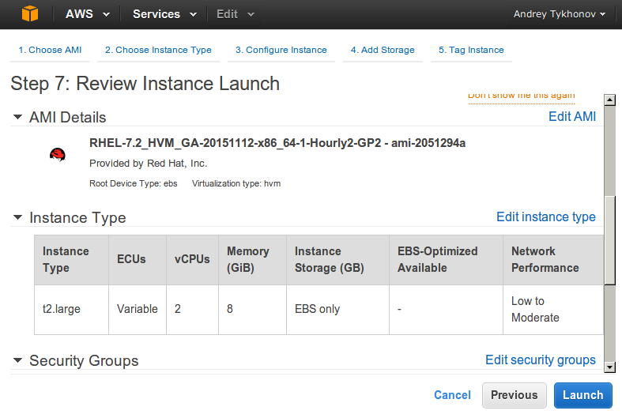
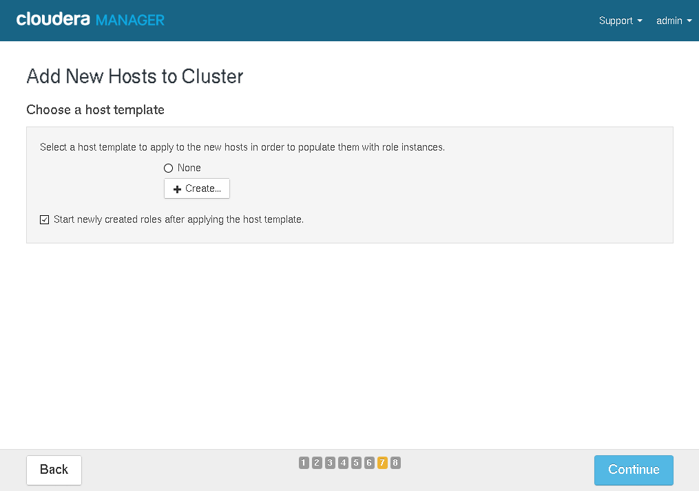

# Launch master instance


Click `Launch Instance`.

##  Step 1: Choose an Amazon Machine Image (AMI)


Select `Community AMIs`. Check `Red Hat` checkbox.


Then click `Select`.


## Step 2: Choose an Instance Type

Choose `t2.large` and click `Next: Configure Instance Details`.


##  Step 3: Configure Instance Details

If you don't have any network (VPC) please create it. Please create subnet as well, if there is no any subnet in the list.

Please change `Auto-assign Public IP` to `Enable`.


Click `Next: Add Storage`.

##  Step 4: Add Storage

Input into the field `Size (GiB)` value `25`. Click `Next: Tag Instance`.


## Step 5: Tag Instance

Just click `Next: Configure Security Group`.

##  Step 6: Configure Security Group

Select `All traffic` from select-box `Type` and click `Review and Launch`.


##  Step 7: Review Instance Launch

Click `Launch`!



## Select an existing key pair or create a new key pair

Select "Create a new key pair" and input key pair name (e.g. `cloudera`), then click `Download Key Pair` and save the file. After that the `Launch Instances` button will become enabled. Click it.


## Launch status

Here you can see launch status. Click on `View Instances`.


## Instances

Here we can see the list of launched instances.


Before connection to the instance, please change permissions for the recently downloaded `cloudera.pem` file:

```
chmod 600 cloudera.pem
```

On top of the list you can see the running instance. The one which has been recently created.

From the bottom panel take `Public IP` of the instance and put it to `/etc/hosts` (please, don't do it in this way if you did it once for `master.cloudera`. Edit `/etc/hosts` using any text editor instead and modify existing record):

```
sudo -s

echo "54.146.201.153 master.cloudera" >> /etc/hosts
```


Then, on the local machine execute the following in order to connect to master instance:

```
ssh -i cloudera.pem ec2-user@master.cloudera
```

Please specify the full path to the `cloudera.pem` if it is not located in the current directory. You might be asked: `Are you sure you want to continue connecting (yes/no)?`. Say: yes!

As the result you should get the shell:


Welcome, you're on master instance!

# Launch slave instance

In order to launch slave, you could perform the same steps as for master, except the following:

1) Select `t2.small` instance type.

2) You don't need to create a network or subnet (select existing one).

3) Please, don't forget to change `Auto-assign Public IP` to `Enable`.

4) Select an existing key pair (e.g. cloudera.pm).

## Check that you can connect to slave

Take the `Public IP` of slave instance and put it to `/etc/hosts` (please, don't do it in this way if you did it once for `slave.cloudera`. Edit `/etc/hosts` using any text editor instead and modify existing record):

```
sudo -s

echo "107.22.45.103 slave.cloudera" >> /etc/hosts
```

Try to connect to it:

```
ssh -i cloudera.pem ec2-user@slave.cloudera
```

Welcome, you're on slave instance!

# Configure the instances

## Getting private IPs

First of all let's get private IPs of the instances. Go to master instance:

```
ssh -i cloudera.pem ec2-user@master.cloudera
```

And execute there `ifconfig`:

```
ifconfig
```

You should get the following in response:


The private IP in my case is `172.30.243.82`. Remember it or better write it down :)

Please perform the same for slave instance and write down its private IP.

In my case it equals to `172.30.169.105`.

## Disable SELinux

Connect to master instance:

```
ssh -i cloudera.pem ec2-user@master.cloudera
```

In order to disable SELinux execute the following command:

```
sudo sed -i 's/SELINUX=enforcing/SELINUX=disabled/g;' /etc/sysconfig/selinux
```

Please check:

```
cat /etc/sysconfig/selinux
```

In the output you should see `SELINUX=disabled`.

Now, please executed the following command:

```
sudo sed -i 's/LANG=en_US.UTF-8/LANG=en_US.UTF-8 selinux=0/g;' /boot/grub2/grub.cfg
```

Please check:

```
sudo cat /boot/grub2/grub.cfg | grep -C 2 "selinux=0"
```

You should get something like the following:

```
          search --no-floppy --fs-uuid --set=root 379de64d-ea11-4f5b-ae6a-0aa50ff7b24d
        fi
        linux16 /boot/vmlinuz-3.10.0-327.el7.x86_64 root=UUID=379de64d-ea11-4f5b-ae6a-0aa50ff7b24d ro console=ttyS0,115200n8 console=tty0 net.ifnames=0 crashkernel=auto LANG=en_US.UTF-8 selinux=0
        initrd16 /boot/initramfs-3.10.0-327.el7.x86_64.img
}
```

If you don't see any output, then something is wrong.

Now, please reboot your instance:

```
sudo reboot
```

After a while connect again to master instance and execute:

```
getenforce
```

You should receive in response:

```
Disabled
```

SELinux is successfully disabled!


**Perform exactly the same steps for slave instance!**

## Configure hosts

### Configure master instance

Connect to master instance:

```
ssh -i cloudera.pem ec2-user@master.cloudera
```

Execute the following commands:

```
sudo -s

echo "172.30.243.82 master.cloudera" >> /etc/hosts

echo "172.30.169.105 slave.cloudera" >> /etc/hosts

exit
```

172.30.243.82 - private IP of master instance.

172.30.169.105 - private IP of slave instance.

Check that the records are present:

```
cat /etc/hosts
```

You should get something like the following in output:

```
127.0.0.1   localhost localhost.localdomain localhost4 localhost4.localdomain4
::1         localhost localhost.localdomain localhost6 localhost6.localdomain6

172.30.243.82 master.cloudera
172.30.169.105 slave.cloudera
```

Now, please, execute the following command:

```
sudo -s

echo "master.cloudera" > /etc/hostname

echo "HOSTNAME=master.cloudera" >> /etc/sysconfig/network

echo "preserve_hostname: true" >> /etc/cloud/cloud.cfg

exit
```

Now reboot:

```
sudo reboot
```

Connect again and check:

```
hostname
```

The output should be `master.cloudera`.

```
hostname --fqdn
```

Here should be the same output: `master.cloudera`.

Our host name has been successfully changed!

### Configure slave instance

Now, we will be configuring slave instance using mostly the same steps (but not the same, be careful) as for master.

Connect to slave:

```
ssh -i cloudera.pem ec2-user@slave.cloudera
```

Execute the following:

```
sudo -s

echo "172.30.243.82 master.cloudera" >> /etc/hosts

echo "172.30.169.105 slave.cloudera" >> /etc/hosts

exit
```

Check that the records are present:

```
cat /etc/hosts
```

You should get something like the following in output:

```
127.0.0.1   localhost localhost.localdomain localhost4 localhost4.localdomain4
::1         localhost localhost.localdomain localhost6 localhost6.localdomain6

172.30.243.82 master.cloudera
172.30.169.105 slave.cloudera
```

Now, please, execute the following command:

```
sudo -s

echo "slave.cloudera" > /etc/hostname

echo "HOSTNAME=slave.cloudera" >> /etc/sysconfig/network

echo "preserve_hostname: true" >> /etc/cloud/cloud.cfg

exit
```

Now reboot:

```
sudo reboot
```

Connect again and check:

```
hostname
```

The output should be `slave.cloudera`.

```
hostname --fqdn
```

Here should be the same output: `slave.cloudera`.

Our host name has been successfully changed!

# Install cloudera


Connect to master:

```
ssh -i cloudera.pem ec2-user@master.cloudera
```

Then download cloudera:

```
sudo yum install -y wget

wget http://archive.cloudera.com/cm5/installer/latest/cloudera-manager-installer.bin

chmod +x cloudera-manager-installer.bin

sudo ./cloudera-manager-installer.bin
```


Click `Next`, then `Next`, accept the license, click `Next`, accept the license again, and wait until it will be installed.

When installation is finished, the wizard prompts you to visit `http://master.cloudera:7180/`. Do it!


# Cloudera configuration

Open `http://master.cloudera:7180/` and you'll get login page. Use username `admin` and password `admin`. (If you don't see login page, but "Unable to load page" instead, just wait for a while and try again).

## End User License Terms and Conditions

Check `Yes, I accept the End User License Terms and Conditions.` and click `Continue`.

## Which edition do you want to deploy?

Click `Continue`.

## Thank you for choosing Cloudera Manager and CDH.

Click `Continue`.

## Specify hosts for your CDH cluster installation.


Enter private IP of master and click `Search`.


Master is selected, click `Continue`.

## Select Repository

Click `Continue`.

## JDK Installation Options

Check `Install Oracle Java SE Development Kit (JDK)` and click `Continue`.


## Enable Single User Mode 

Click `Continue`.

## Provide SSH login credentials.

Select `Another user` and input `ec2-user`. Then select `Authentication Method` equals to `All hosts accept same private key`, click on `Choose File` and open `cloudera.pem` file. Click `Continue`. You will be asked: `Continue SSH login with no passphrase?`. Say: Ok!

## Installation in progress. 

We need to wait for a while and click `Continue`.

## Installing Selected Parcels

Coffee time (~5m). After coffee break click `Continue`.

## Inspect hosts for correctness

Most probably you'll see the same errors as could be seen on the screenshot:


So, in order to fix them execute the following (master instance):

```
sudo -s

sysctl vm.swappiness=10

echo never > /sys/kernel/mm/transparent_hugepage/defrag

echo never > /sys/kernel/mm/transparent_hugepage/enabled

exit
```

Click `Run Again`. The errors should be absent. Click `Finish`.

## Choose the CDH 5 services that you want to install on your cluster

Select `Custom Services`, then `HBase`, `HDFS`, `MapReduce` and `YARN`. Click `Continue`.

## Customize Role Assignments

Click `Continue`.

## Database Setup

Click `Test Connection` then `Continue`.

## Review Changes

Click `Continue`.

## First Run

Pray!

## Congratulations!

Click `Finish`.

# Cloudera Manager

## Fix errors

At this point several errors could be seen. There was another one with ZooKeeper which was fixed by means of restarting of ZooKeeper. Just click on the arrow and click `Restart`.


After a while all other errors disappeared except for HDFS.

Click on red exclamation sign.


Click `Under-Replicated Blocks`.


Click on `Change Under-replicated Block Monitoring Thresholds for this service`.


Input `100` into `Critical` and `Warning` input fields and `Save Changes`.

Now, go to home page and see that instead of error we have the warning.

## HDFS configuration

On the home page click `HDFS` link (`Status` section).

Click `Configuration` and input `dfs.permissions`.


Uncheck `HDFS (Service-Wide)` and click `Save Changes`.


Near `Actions` button you'll see restart button. Click it.


Click `Restart Stale Services`.


Check `Re-deploy client configuration` and click `Restart Now`.

After a while the services will be restarted.


Click `Finish`.

## YARN configuration

On the home page click `YARN (MR2 Included)` link.

Go to `Configuration` page and input `yarn.nodemanager.resource.memory-mb`.


Input `2.5`. Please make sure that `GiB` is selected. Click `Save Changes`.

Now, instead of `yarn.nodemanager.resource.memory-mb` please input `yarn.scheduler.minimum-allocation-mb`.


Input `750` and make sure that `MiB` is selected. Click `Save Changes`.


Near `Actions` button you can see two icons. Click on the second one (redeployment).

On the next screen click `Restart Stale Services`. And then click `Restart Now`.

After a while all services will be restarted. Click `Finish`.

## Execution of test application on a single node (master)

Download test application `wordcount-1.0-SNAPSHOT-jar-with-dependencies.jar` and upload it to master by means of the following command:

```
scp -i cloudera.pem wordcount-1.0-SNAPSHOT-jar-with-dependencies.jar ec2-user@master.cloudera:/home/ec2-user/
```

Connect to master instance:

```
ssh -i cloudera.pem ec2-user@master.cloudera
```

Then execute the following commands:

```
sudo su hdfs

hadoop fs -mkdir /home /home/root

hadoop fs -chown root /home/root

exit

sudo -s

hadoop fs -mkdir /home/root/wordcount /home/root/wordcount/input

echo "Hadoop is an elephant" > file0

echo "Hadoop is as yellow as can be" > file1

echo "Oh what a yellow fellow is Hadoop" > file2

hadoop fs -put file* /home/root/wordcount/input

hadoop jar wordcount-1.0-SNAPSHOT-jar-with-dependencies.jar WordCount /home/root/wordcount/input /home/root/wordcount/output
```

The following output could be seen in response:

```
16/11/02 06:19:31 INFO client.RMProxy: Connecting to ResourceManager at master.cloudera/172.30.191.118:8032
16/11/02 06:19:32 WARN mapreduce.JobResourceUploader: Hadoop command-line option parsing not performed. Implement the Tool interface and execute your application with ToolRunner to remedy this.

16/11/02 06:19:34 INFO input.FileInputFormat: Total input paths to process : 3
16/11/02 06:19:35 INFO mapreduce.JobSubmitter: number of splits:3
16/11/02 06:19:35 INFO mapreduce.JobSubmitter: Submitting tokens for job: job_1478081832568_0001
16/11/02 06:19:36 INFO impl.YarnClientImpl: Submitted application application_1478081832568_0001
16/11/02 06:19:36 INFO mapreduce.Job: The url to track the job: http://master.cloudera:8088/proxy/application_1478081832568_0001/
16/11/02 06:19:36 INFO mapreduce.Job: Running job: job_1478081832568_0001
16/11/02 06:19:47 INFO mapreduce.Job: Job job_1478081832568_0001 running in uber mode : false
16/11/02 06:19:47 INFO mapreduce.Job:  map 0% reduce 0%
16/11/02 06:19:55 INFO mapreduce.Job:  map 33% reduce 0%
16/11/02 06:19:59 INFO mapreduce.Job:  map 67% reduce 0%
16/11/02 06:20:06 INFO mapreduce.Job:  map 100% reduce 0%
16/11/02 06:20:13 INFO mapreduce.Job:  map 100% reduce 100%
16/11/02 06:20:14 INFO mapreduce.Job: Job job_1478081832568_0001 completed successfully
16/11/02 06:20:14 INFO mapreduce.Job: Counters: 49
        File System Counters
                FILE: Number of bytes read=143
                FILE: Number of bytes written=489960
                FILE: Number of read operations=0
                FILE: Number of large read operations=0
                FILE: Number of write operations=0
                HDFS: Number of bytes read=458
                HDFS: Number of bytes written=80
                HDFS: Number of read operations=12
                HDFS: Number of large read operations=0
                HDFS: Number of write operations=2
        Job Counters 
                Launched map tasks=3
                Launched reduce tasks=1
                Data-local map tasks=3
                Total time spent by all maps in occupied slots (ms)=31530
                Total time spent by all reduces in occupied slots (ms)=9136
                Total time spent by all map tasks (ms)=15765
                Total time spent by all reduce tasks (ms)=4568
                Total vcore-seconds taken by all map tasks=15765
                Total vcore-seconds taken by all reduce tasks=4568
                Total vcore-seconds taken by all map tasks=15765                                                                            [0/108]
                Total vcore-seconds taken by all reduce tasks=4568
                Total megabyte-seconds taken by all map tasks=16143360
                Total megabyte-seconds taken by all reduce tasks=4677632
        Map-Reduce Framework
                Map input records=3
                Map output records=18
                Map output bytes=158
                Map output materialized bytes=224
                Input split bytes=372
                Combine input records=18
                Combine output records=17
                Reduce input groups=12
                Reduce shuffle bytes=224
                Reduce input records=17
                Reduce output records=12
                Spilled Records=34
                Shuffled Maps =3
                Failed Shuffles=0
                Merged Map outputs=3
                GC time elapsed (ms)=241
                CPU time spent (ms)=2290
                Physical memory (bytes) snapshot=1526329344
                Virtual memory (bytes) snapshot=6335172608
                Total committed heap usage (bytes)=1474822144
        Shuffle Errors
                BAD_ID=0
                CONNECTION=0
                IO_ERROR=0
                WRONG_LENGTH=0
                WRONG_MAP=0
                WRONG_REDUCE=0
        File Input Format Counters 
                Bytes Read=86
        File Output Format Counters 
                Bytes Written=80
```

So far so good!

## Check the results of the execution

Go to `YARN (MR2 Included)`. Then open `Applications` page.


You can see the results of executed application.

Go to `Web UI` -> `ResourceManager Web UI (master)`.


Click on application link (e.g. `application_1478081832568_0001`).


Click `History` link.


Click `3` link, in `Maps` row, `Successfull` column.


## Execution of test application on master and slave

Go to `Cloudera Manager`. Then `Hosts` -> `All Hosts`.


Click `Add New Hosts to Cluster`.

On the next screen click `Continue`.

### Specify hosts for your CDH cluster installation.


Input private IP of slave instance and click `Search`.

Slave instance is selected. Click `Continue`.


Click `Continue`.


Check `Install Oracle Java SE Development Kit (JDK)` and click `Continue`.


Select `Another user` and input `ec2-user`. Then select `Authentication Method` equals to `All hosts accept same private key`, click on `Choose File` and open `cloudera.pem` file. Click `Continue`. You will be asked: `Continue SSH login with no passphrase?`. Say: Ok!

### Installation in progress.

Click `Continue`.

### Installing Selected Parcels 

Coffee time again (~5m). After coffee break click `Continue`.

### Inspect hosts

Most probably you'll see the same errors as could be seen on the screenshot:


So, in order to fix them execute the following (slave instance):

```
sudo -s

sysctl vm.swappiness=10

echo never > /sys/kernel/mm/transparent_hugepage/defrag

echo never > /sys/kernel/mm/transparent_hugepage/enabled

exit
```

Click on `Run Again` and see that the errors are absent. Click `Continue`.

### Choose a host template



Select `None`. And click `Continue`.


Click `Finish`.


### HDFS configuration

Go to `HDFS`, click `Actions` button and select `Add Role Instances`.


Select `All Hosts` for `DataNode`.


Click `Continue` and then click `Finish`.

On the top, near `Actions` button you'll see deployment icon. Click it.

On the next screen click `Refresh & Deploy Client Config`. And click `Finish`.

### YARN configuration

Go to `YARN (MR2 Included)`, click `Actions` button and select `Add Role Instances`.

Select `All Hosts` for `NodeManager`.

Click `Continue` and then click `Finish`.

On the top, near `Actions` button you'll see deployment icon. Click it.

On the next screen click `Deploy Client Configuration`. And click `Finish`.

### Start Roles on Hosts

Go to `Hosts` -> `All Hosts`. Select `slave.cloudera` link from the list. Click `Actions` button and select `Start Roles on Hosts`.

### Execute test application

Connect to master instance:

```
ssh -i cloudera.pem ec2-user@master.cloudera
```

Then execute the following commands:

```
hadoop jar wordcount-1.0-SNAPSHOT-jar-with-dependencies.jar WordCount /home/root/wordcount/input /home/root/wordcount/output2
```

It is mostly the same as the previous one, except that the last argument is `/home/root/wordcount/output2` instead of `/home/root/wordcount/output`.

The following output could be seen in response:

```
16/11/02 07:13:55 INFO client.RMProxy: Connecting to ResourceManager at master.cloudera/172.30.191.118:8032
16/11/02 07:13:56 WARN mapreduce.JobResourceUploader: Hadoop command-line option parsing not performed. Implement the Tool interface and execute your application with ToolRunner to remedy this.
16/11/02 07:13:56 INFO input.FileInputFormat: Total input paths to process : 3
16/11/02 07:13:57 INFO mapreduce.JobSubmitter: number of splits:3
16/11/02 07:13:57 INFO mapreduce.JobSubmitter: Submitting tokens for job: job_1478081832568_0002
16/11/02 07:13:57 INFO impl.YarnClientImpl: Submitted application application_1478081832568_0002
16/11/02 07:13:57 INFO mapreduce.Job: The url to track the job: http://master.cloudera:8088/proxy/application_1478081832568_0002/
16/11/02 07:13:57 INFO mapreduce.Job: Running job: job_1478081832568_0002
16/11/02 07:14:07 INFO mapreduce.Job: Job job_1478081832568_0002 running in uber mode : false
16/11/02 07:14:07 INFO mapreduce.Job:  map 0% reduce 0%
16/11/02 07:14:13 INFO mapreduce.Job:  map 33% reduce 0%
16/11/02 07:14:19 INFO mapreduce.Job:  map 67% reduce 0%
16/11/02 07:14:25 INFO mapreduce.Job:  map 100% reduce 0%
16/11/02 07:14:34 INFO mapreduce.Job:  map 100% reduce 100%
16/11/02 07:14:35 INFO mapreduce.Job: Job job_1478081832568_0002 completed successfully
16/11/02 07:14:35 INFO mapreduce.Job: Counters: 49
        File System Counters
                FILE: Number of bytes read=143
                FILE: Number of bytes written=490060
                FILE: Number of read operations=0
                FILE: Number of large read operations=0
                FILE: Number of write operations=0
                HDFS: Number of bytes read=458
                HDFS: Number of bytes written=80
                HDFS: Number of read operations=12
                HDFS: Number of large read operations=0
                HDFS: Number of write operations=2
        Job Counters 
                Launched map tasks=3
                Launched reduce tasks=1
                Data-local map tasks=3
                Total time spent by all maps in occupied slots (ms)=26090
                Total time spent by all reduces in occupied slots (ms)=13172
                Total time spent by all map tasks (ms)=13045
                Total time spent by all reduce tasks (ms)=6586
                Total vcore-seconds taken by all map tasks=13045
                Total vcore-seconds taken by all reduce tasks=6586
                Total megabyte-seconds taken by all map tasks=13358080
                Total megabyte-seconds taken by all reduce tasks=6744064
        Map-Reduce Framework
                Map input records=3
                Map output records=18
                Map output bytes=158
                Map output materialized bytes=224
                Input split bytes=372
                Combine input records=18
                Combine output records=17
                Reduce input groups=12
                Reduce shuffle bytes=224
                Reduce input records=17
                Reduce output records=12
                Spilled Records=34
                Shuffled Maps =3
                Failed Shuffles=0
                Merged Map outputs=3
                GC time elapsed (ms)=222
                CPU time spent (ms)=2610
                Physical memory (bytes) snapshot=1553723392
                Virtual memory (bytes) snapshot=6366474240
                Total committed heap usage (bytes)=1410859008
        Shuffle Errors
                BAD_ID=0
                CONNECTION=0
                IO_ERROR=0
                WRONG_LENGTH=0
                WRONG_MAP=0
                WRONG_REDUCE=0
        File Input Format Counters 
                Bytes Read=86
        File Output Format Counters 
                Bytes Written=80
```

So far so good.

### Check the results of the execution

Go to `YARN (MR2 Included)`, select `Applications`. You can see recently executed application.

Click `Web UI` -> `Resource Manager Web UI (master)`.

Click `application_1478081832568_0002` application link.

Click `History` link.

Then click `3` link on the bottom of the page (`Maps` row, `Successful` column).


Make sure that in the column `Node` there are present both master and slave!

# Stopping instances

Actually there are two options:

### Terminate the instances

If you terminate your instances, they will be destroyed. So all work will be lost. But we need it in order to accomplish further tasks.

### Stop the instances

Probably it is better to stop the instances. Later you can start them. However, you need to pay money for stopped instances. Stopped instances are cheaper than running.

## Start the stopped instances

First of all, please, start slave instance. Wait until it is initialized and try to connect to it. After you are successfully connected, start master instance.


Probably, you'll be experiencing the same issues as could be seen on the screenshot above.

In this case, please, in the yellow area, find and click `View the status of the Service Monitor`. Then click `Actions` button and select `Restart`.

Then go to home page, click `View the status of the Host Monitor`, then click `Actions` button and select `Restart`.

After that, I would recommend to restart whole cluster. Go to home page, click on `Cluster 1` link, then click `Actions` button and select `Restart`.

Go to home page and make sure that there is no any service in bad health (a service in bad health is red).

If everything is ok, your cluster is ready to be used.
